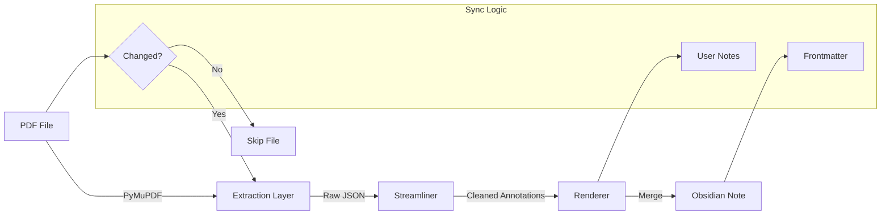

# PDF Annotations

**Turn your PDF library into an active Obsidian knowledge base.**

A robust sync engine that extracts highlights and annotations from PDFs (using PyMuPDF) and renders them into
structured, frontmatter-rich Markdown notes.

---

## Vision

This is not just a file converter; it is the "drumbeat" of a Zettelkasten workflow. The goal is to manage a library of 1600+ academic papers and books, transforming static PDF highlights into a living network of ideas.

**Core Philosophy:**

- **Idempotency**: Only update notes when the PDF actually changes.
- **Data Preservation**: Never overwrite manual user comments in the Markdown note.
- **Process Tracking**: Use frontmatter (`status`, `pdf_mtime`) to drive Obsidian Dataview dashboards.
- **Reliability**: Safe, atomic writes and consistent ID generation.

---

## Architecture

The system follows a strict "Extract → Streamline → Render" pipeline to ensure clean data.



### Extraction: Words-Based Approach

The extraction layer uses a **word-level overlap matching** strategy rather than raw rectangle clipping. For each
highlight annotation, the extractor:

1. **Merges quads by visual line** — highlight quads with similar y-coordinates (within 3pt) are grouped into a single rect per line, preventing typographic characters (curly quotes, apostrophes) from bleeding into adjacent lines.
2. **Matches words by overlap ratio** — page words from `get_text("words")` are matched against merged line rects. A word must have ≥50% area overlap to be included, which rejects stray characters from neighbouring lines.
3. **Detects superscript contamination** — font-size analysis via `get_text("dict")` identifies footnote reference numbers. Words partially overlapping superscript regions have trailing digits stripped; pure superscript words are skipped entirely.

This approach eliminates three classes of extraction artefacts: stray single characters (`g`, `p`), footnote number leakage (`of).4`), and intra-highlight misordering.

### Change Detection: Fast Skip

The sync engine checks `pdf_mtime` and `pdf_size` against the note's frontmatter **before** opening the PDF. Unchanged files are skipped without any PDF parsing, making repeated `make run` calls fast even across 1600+ files.

> **Note:** For the future roadmap and planned features, see [`GOALS.md`](GOALS.md).

---

## Quick Start

The project is managed via a standardized `Makefile`.

### 1. Setup

Initialize the environment and configuration:

```bash
make setup
```

*This creates the virtual environment, installs dependencies, and generates `pdf_annot.toml` from the example if
missing.*

### 2. Configuration

Edit `pdf_annot.toml` to point to your files:

```toml
[paths]
notes_root = "/Users/me/Obsidian/Zettelkasten/References"
pdf_dirs = ["/Users/me/Documents/Papers"]

[io]
atomic_writes = true
```

### 3. Run Sync

Synchronize your library:

```bash
make run
```

---

## Project Navigation & Context

This project uses a curated "manifest" approach to manage context for AI collaboration.

* **[`manifest.lst`](manifest.lst)**: Single source of truth for project structure.
* **`make filesdump`**: Generates XML-wrapped context dump for LLM sessions.

---

## Architecture Overview & Modules

### Core Workflow: `pdf-annot-sync`

The main entry point is `src/pdf_annot/sync.py`. When run, it automatically:

1. **Loads configuration** (e.g., `pdf_annot.toml`) to get `pdf_dirs` and `notes_root`.
2. **Builds registries** for all PDFs (`PdfRegistry`) and all notes (`NotesDB`).
3. **Loops over every PDF** and compares it to its corresponding note.
4. **Detects changes** by comparing PDF mtime/size with note frontmatter (fast — no PDF parsing).
5. **Calls `sync_pdf_to_note`** only for new or changed PDFs.

This function handles the extraction, streamlining, rendering, and atomic updating. This workflow is tested end-to-end
in `tests/test_core_workflow.py`.

### Library Modules

#### `src/pdf_annot/env.py`

Configuration management via TOML files.

```python
from pdf_annot.env import load_env

env = load_env("pdf_annot.toml")
# Access: env.paths.notes_root, env.annotations.default_info_text
```

#### `src/pdf_annot/sync.py`

The core workflow logic and `main` CLI entry point. Performs a cheap mtime/size check before any PDF parsing, so unchanged files are skipped instantly.

```python
from pdf_annot.sync import sync_pdf_to_note

result = sync_pdf_to_note(env, pdf_info, note_path, current_time_iso)
```

#### `src/pdf_annot/extract.py`

PDF annotation extraction using words-based overlap matching. Handles header/footer exclusion, superscript footnote detection, and visual reading order sorting.

```python
# Library API
annotations, stats = extract_annotations_to_list(pdf_path)
```

*CLI:* `pdf-annot-extract -p document.pdf`

#### `src/pdf_annot/streamline_annotations.py`

Post-processes raw annotations: keeps highlights, merges link annotations (e.g., across pages or hyphens), extracts headings.

```python
# Library API
streamlined = streamline_annotations_list(raw_annotations)
```

*CLI:* `pdf-annot-streamline -i raw.ndjson -o streamlined.ndjson`

#### `src/pdf_annot/frontmatter.py`

YAML frontmatter parsing and manipulation. Safely updates PDF-specific fields while preserving user-added tags or categories.

```python
changed, updated_text = upsert_fields(note_text, {"pdf_title": "New"})
```

#### `src/pdf_annot/notes.py` & `ndjson_to_md_block.py`

Handles extraction of custom info text (preserves user edits) and rendering of the annotation block.

#### `src/pdf_annot/pdf_registry.py` & `notes_db.py`

Indexing systems for discovering controlled PDFs (bracket format) and existing Markdown notes.

#### `src/pdf_annot/resolve.py`

Resolver CLI: maps a `crc32_az7` hash (as it appears in a `pdf://<HASH>` URL) to a fully-qualified PDF path. This is the public interface consumed by the macOS PDF viewer (Anima) as a subprocess -- the contract is the CLI surface (stdout / stderr / exit code), frozen in `TARGET_ARCHITECTURE.md`. It reuses `build_pdf_index` and imports nothing heavy (no PyMuPDF), so per-click latency stays low. Must be run with the working directory set to the project root, so `load_env` finds `pdf_annot.toml`.

```bash
# Prints the absolute path on success (exit 0); a one-line reason on stderr otherwise (exit 1)
pdf-annot-resolve VQGPEHE
```

---

## Key Concepts

### PDF URL Click Handler

This project generates hash-based `pdf://` links (e.g., `pdf://VQGPEHE?page=1`). Clicking one opens the referenced PDF at the requested page.

* **macOS (current):** the link is handled natively by the PDF viewer (Anima) together with `pdf_annot.resolve`, which turns the hash into a path. The resolver is stateless -- it rebuilds its index from the filesystem on every click, so there is no cache to refresh. See `TARGET_ARCHITECTURE.md` for the full contract.
* **Windows (legacy):** a helper application in `windows_server/` intercepts `pdf://` URLs (via Parallels) and opens the PDF in PDF-XChange. See `windows_server/README.md` for setup. This path is retained for the Windows machine only.

### PDF ID and Hash

* **pdf_id**: Normalized identifier extracted from filename, e.g., `(Das 2000b)`.
* **pdf_hash**: 7-letter CRC32-based hash of the lowercase ID. Used for stable linking even if files move.

### Controlled PDFs

PDFs must follow the naming convention: `(Author Year) Title.pdf`.

* Example: `(Albini 2013) On dealing with destructive emotions.pdf`

### Note Structure

```markdown
---
pdf_id: "(Albini 2013)"
pdf_title: "On dealing with destructive emotions"
pdf_size: 91354
pdf_hash: "VQGPEHE"
has_annotations: true
pdf_mtime: "2025-10-21T21:37:00"
last_run_at: "2025-10-30T20:01:00"
pdf_pages: 12
pdf_highlights: 6
pdf_textboxes: 0
---

<hr class="pdf-annot-sep">

<span class="pdf-annot-info">below the automatically generated annotations from the PDF</span>

## Section Header

> Highlight <span class="pdf-annot-date">21.10.25 21:20</span> [1](pdf://VQGPEHE?page=1)
```

### Info Text Preservation

The `<span class="pdf-annot-info">...</span>` text is designed to be edited by the user. The sync workflow **preserves** this text rather than overwriting it with defaults.

---

## Makefile Targets

```bash
# Setup
make setup          # Create venv, install deps, generate config

# Core Workflow
make run            # Sync all PDFs to notes

# Testing
make test           # Run tests (quiet)
make test-verbose   # Run tests with output

# Utilities
make hash ARGS="(Author Year)"  # Get 7-char hash for PDF ID
make discover-pdfs              # List all PDFs visible to config
make showtree                   # Display project structure
make filesdump                  # Create context dump for LLMs
```

---

## Development

### Testing

We use strict TDD. Tests must pass before features are merged.

```bash
make test           # Run quiet
make test-verbose   # Run with detailed output
```

The test suite includes extraction quality regression tests using real academic PDFs (e.g., Fasching 2008) with golden file comparison to catch artefacts like stray characters, footnote leakage, and sort order issues.

### Utilities

```bash
# Get the 7-char hash for a PDF ID
make hash ARGS="(Albini 2013)"

# Discover all PDFs visible to the config
make discover-pdfs
```

### Project Structure

```bash
make showtree
```

Displays the project layout (src-layout pattern).

---

## Troubleshooting

### "Files not updating"

* Check `pdf_annot.toml` paths.
* The system skips files where `pdf_mtime` in the note matches the PDF on disk. Touch the PDF to force an update.

### "ImportError: No module named..."

* Ensure you are using `make run` or `make test`, which handle `PYTHONPATH` automatically.

### "Hash not found"

* **macOS:** the resolver rebuilds its index on every click, so there is nothing to restart. A hash that will not resolve means the PDF is not in a folder listed under `pdf_dirs`, or a duplicate `pdf_id` exists somewhere in those folders (any duplicate fails all resolutions by design). Run `make discover-pdfs` to see what the config actually indexes.
